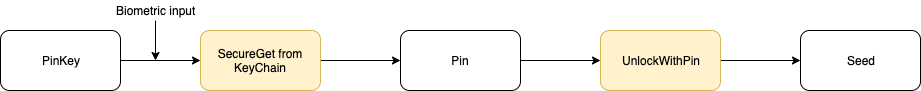
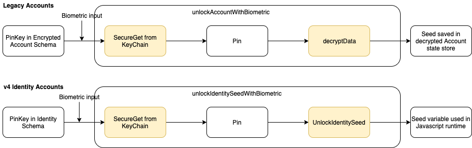

# Seed Phrase Unlocking on Parity Signer

### Seed Unlock with Pin

This article discusses the current seed phrase unlock mechanism and further improvement on user experience and security.

In Legacy account, account data is store as encrypted data, that means the seed phrase is stored with encrypted format like `{"cipher":"aes-128-ctr","cipherparams":{"iv":e872394210984322432423,"cipherText":"a352dfg3g4245..."}}`.
When a user input the pin and unlock it, a seed phrase will be decrypted and the clear text of the seed phrase will remain in the app's state storage, and we clean it by using `deleteSensitiveData`. In Javascript runtime, we can not make sure that the data is really deleted from memory since there is no way to force the garbage collection.

Currently (in v4 version), user need to input Pin to unlock seed each time seed phrase is needed, it avoids to store the clearText of seed phrase into app's state. We shorten the time that clear text value stored in memory, the data is still garbage collected automatically by Javascript engine and we can not force it. Furthermore, Such an unlocking process blocks some UI features like showing the address of the key pairs with each keyboard stroke, and bring more pin input prompt which raises controversial user experiences.

```javascript
	const seed = await unlockSeedPhrase(navigation, currentIdentity);
	//use the seed to sign data
```

Workflow is as followings (the process with yellow background indicate it is in a Rust/Native runtime, and the seed value used there is protected):


### Seed Unlock with Biometric Data

In the PR [#416](https://github.com/paritytech/parity-signer/pull/416), we prompt a new way to unlock the seed, with user's biometric data like TouchId or FaceId. It keeps a permanent PinKey in the user state once a user enables it, and store the pin in keychain/keystore, by verifying user's biometric data, the pin is fetched to get the seed.

A big improvement is that, with biometric input, the signing process in just happens in Rust runtime, there will be no seed phrase data exposed into Javascript runtime but only a PinKey as a ID of pin.


Showing seed phrase also changed, but seed phrase is still exposed in Javascript runtime, which could be improved in the future, to move the unlock process also into Rust / Native runtime, which could be seen here:



With legacy and v4 accounts, the workflow is slightly different, To be more specific.

 

### Seed reuse with Pointer

With biometric input, we still face the frequent authentication problem. In order to solve it and have the benefit of biometric data input in pin input, (i.e. minimal the exposure of seed phrase in Javascript runtime), we could keep the current seed phrase unlock process for the first time in the app's lifecycle, in addition, we return a pointer to the seed, and keep the protected seed phrase value in the Rust runtime.

The second time the user needs the seed phrase, he/she just use pointer to get the seed and do the signing function.

```javascript
  //first time use seed, navigate to pin input screen
  const seedPointer = await unlockSeedPhrase(navigation, currentIdentity);

  // second time use seed in app lifecycle
  const signedData = await signDataWithPointer(dataToSign, seedPointer);
``` 

But if the user wants to see the recovery phrase (display it on UI component, expose it to Javascript runtime), the pin/biometric input is still needed.

The workflow would be like followings: 


By this method, we only need to pass authentication of the app once, and we will not even store the seed in the signing process even without biometric data.

Furthermore, with this method, the seed data stored in rust runtime could be encrypted, and the pointer return could be a decrypted key. 

