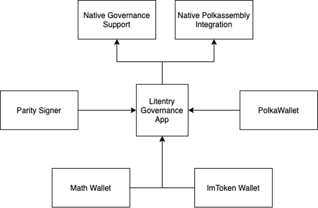

# Proposal: [Governance-focused Mobile App for all Substrate-based networks]
Proponent: (Hanwen/Litentry) `12R4GcpJaQyrDAVZJogjg4UEB4X7cnaUwP9B6c8xHaQc3R2S`

Date: 27.11.2020

Requested DOT: 

Short description: Governance-focused Mobile App for all Substrate-based networks

---
## 1. Context of Proposal

Hanwen Cheng is the previous product owner of Parity Signer. He has rich experience in building mobile and web applications, and also very familiar with Substrate based tools. Now working for Litentry Technologies GmbH, the company is a technology company focus on building a cross-chain identity aggregator. Which includes the substrate-based network and related tools. The team has solid substrate development experience and also focus on mobile engineering.

## 2.	Problem statement: 

There are a few identified issues when it comes to on-chain governance as we experience it on Polkadot and Kusama:

a.Low Voting Participation Rate: Currently the on-chain governance participation rate is quite low, even for controversial decisions like Kusama redenomination, (where there is only about 10% of staker holder take part in the vote).

b. Missing Identity Governance Stats: When voting for the council members, it is hard to know who, from all councillors, has made the most contributions to the ecosystem and who has participated the most in the discussions: Currently, there is no dashboard to show on-chain governance stats of identity. Also, on Polkadot.js Apps and Polkassembly, the identity tooltip is limited to certain fields, therefore more information is needed when user browse and participate in governance.

c. After browsing the wallets listed on https://wiki.polkadot.network/docs/en/build-wallets, currently there is only Polkawallet native support for governance module. The other wallets either use integrated governance DApp in a WebView, or do not even governance module integration at the moment. Each mobile app has its own governance UI, the engineering power is wasted and lacks interoperability.   

Imtoken |  Math Wallet | Polkawallet
:-------------------------:|:-------------------------:|:---|
  |  | 

d. Polkadot.js Apps is mostly used for experienced users or developers. In addition, it includes all the UI to interact with substrate-based blockchains, and it aims to be a general-purpose front-end application.

e. Currently, there is no mobile application to relay the transaction from other wallets on the Polkadot ecosystem: Parity Signer and Math Wallet could sign the transaction from Polkadot.js Apps. The wallet ecosystem is relatively small. 

## 3.	Proposal Objective/solution/s:

### Objective

We want to create a governance mobile application which could:

1. Offer native governance support integrated to Polkadot UI and Polkassembly off-chain discussion. 
2. Provide identity governance statistics for users who participated in governance and provide gamification score to incentive users to join governance.
3. Provide interoperability with other mobile wallets (QR code / inter-app communication) to let them sign governance calls. 
 
|Governance Ecosystem Before|Governance Ecosystem Before|
|-------------------------|-------------------------|
|||

### Solutions / Milestones

#### Milestone 1: On-chain governance basic support
* Native OCG(on-chain governance) actions support on Polkadot/Kusama
* Enable interaction with Parity Signer with QR code.

#### Milestone 2: Integrate identity registration
* Offer user interface to register Identity on Polkadot/Kusama.
* Submit a new automatic registrar with the status of each field on Polkadot/Kusama.
* Show Identity registration Status on Polkadot/Kusama. 

#### Milestone 3: Identity Dashboard
* Show identity OCG(on-chain governance) states on Polkadot/Kusama.
* Native support for off-chain discussion from Polkassemby

#### Milestone 4 Inter-app communication
* Interact with other wallet app and sign the transactions with inter-app communication (work together with WalletConnect if their protocol has been done).

#### Milestone 5 Governance Score and Lottery integration
* Be able to do OCG actions on different networks.
* Add gamification score for users who joined on-chain governance.
* Integrate substrate [lottery](https://hackmd.io/68rduBydTEy4X-ULevd90g) support

### Network Benefit

* Have more users share their voice on important elections. (`vote`)
* Encourage users to register on-chain identity. (`identity`,`setIdentity`,`requestJudgement`)
* Have users change/update their validator nominations on a regular schedule. (`nominate`)
* Encourage brainstorming of ideas in future updates and changes (`propose_bounty`)
* Encourage user to use tipping system (`tip`, `reportAwesome`)
* Have more users (change their) backing of (candidate) council members (`electionPhragmen`, `vote`)
* Encourage users to use lottery modules and join vote (`buy_tickets`, `vote`)
* Encourage users to join the off-chain discussion on Polkassembly.

## 4. Why Polkadot Network.

The governance on Polkadot affects most users and it is of the most important features among all substrate-based networks. 

The technical implementation does not have much difference when we compare Polkadot/Kusama/other Substrate-based networks. So we are doing the work firstly on both Polkadot and Kusama, and then it will be extended to all the substrate-based networks.

 ## 5. Payments and Conditions
 
 |Milestones | estimate development time | total cost | DOT value |
 |---|---|---|---|
 |Milestone 1|  
 |Milestone 2|
 |Milestone 3|
 |Milestone 4|
 |Milestone 5|
 
 
 
