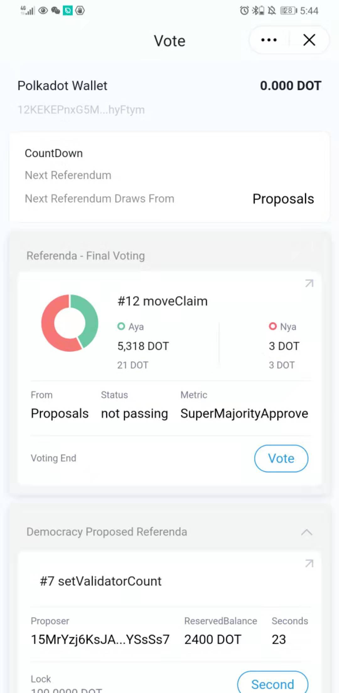
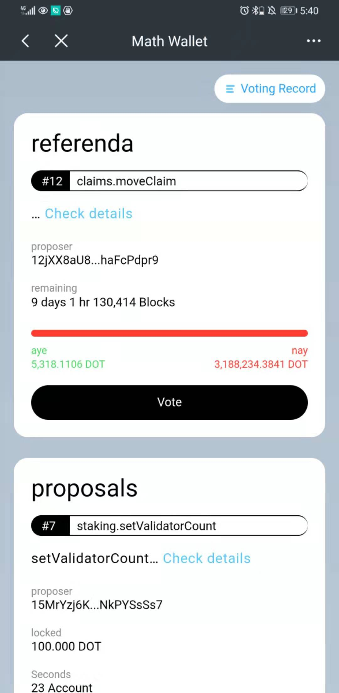
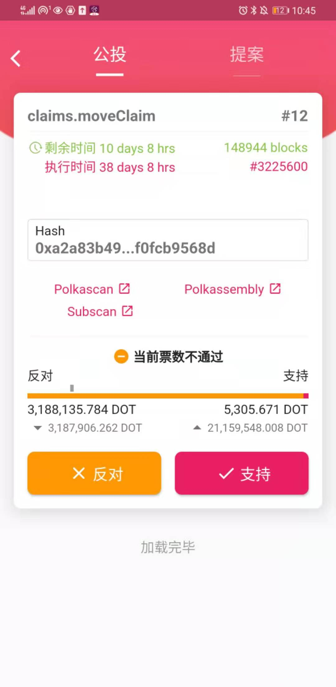
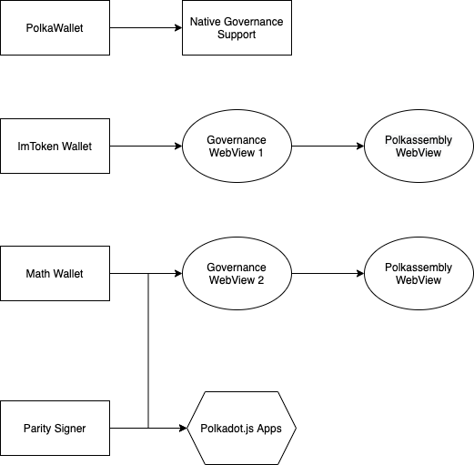
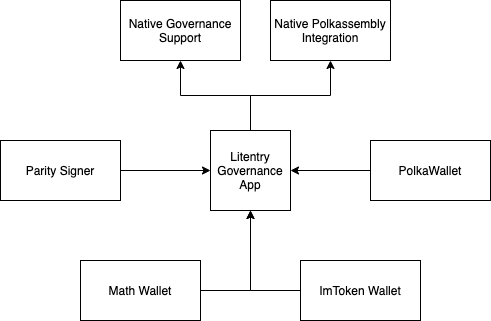

# Proposal: [Governance-focused Mobile App for all Substrate-based networks]
Proponent: (Hanwen/Litentry) `12R4GcpJaQyrDAVZJogjg4UEB4X7cnaUwP9B6c8xHaQc3R2S`

Date: 16.12.2020

Requested DOT: 6132

**Short description**: Governance-focused Mobile App for substrate-based networks

---

In this proposal, we raise the idea of building a governance-focused app with cross-wallet support, which could encourage the user to take part in various on-chain governance actions and be able to interact with on-chain governance activities in a low friction manner, thus improving the on-chain governance engagement.

## 1. Context of Proposal

Hanwen Cheng was the former product owner of [Parity Signer](https://github.com/paritytech/parity-signer). He has rich experience in building mobile and web applications, also very familiar with Substrate-based tools. Now he is working for [Litentry Technologies GmbH](https://www.litentry.com/), a technology company focusing on building a [cross-chain identity aggregator](https://litentry.medium.com/why-we-need-cross-chain-identity-on-polkadot-d59a90c9329c), which includes the substrate-based networks and related tools. The team has solid substrate development experience and specialization in mobile engineering.

Aggregated identity means an identity linked with accounts from different blockchains and off-chain applications/services, which represent the owner behind the accounts, and further present the owner's credibility and reputation in various aspects. 

In this proposal, we present a governance app. It could 

* facilitate the governance process by lowering the participation friction
* increase user engagement by providing clear UI/UX for interactions 
* allow users to subscribe to remote **Push Notifications** for relevant topics
* provide richer information related to the identity across different substrate-based chains
* serve as a basis for more incentive mechanisms

*Polkadot* currently employs *Phragmén Method* to equalize stake holder's voting power in elections. In our eyes, we see a future where the reputation of identity also plays a vital role in calculating the voting power of elections.

## 2. Problem statement:

There are currently a few issues when it comes to on-chain governance on *Polkadot* and *Kusama*:

a. Low Voting Participation Rate: Currently, the on-chain governance participation rate is quite low, even in the case of controversial decisions (such as  *Kusama* redenomination, in which only about 10% of stakeholders participate in the vote).

b. Missing Identity Governance Stats: When voting for the council members, it is hard to know who, from all councilors, has made the most contributions to the ecosystem and who has participated the most in the discussions. Currently, there is no dashboard to show on-chain governance stats of identity. Also, on [Polkadot.js Apps](http://polkadot.js.org/apps/) and [Polkassembly](https://polkadot.polkassembly.io/), the identity tooltip is limited to certain fields. Therefore richer information is needed to be shown when users browse and participate in governance. Opensquare has made a [proposal](https://kusama.polkassembly.io/post/352) on *Kusama* about the treasury reputation recording system, and this system is currently in the web app side.

c. After investigating the wallets listed on https://wiki.polkadot.network/docs/en/build-wallets, currently only [Polkawallet](https://polkawallet.io/) natively supports for governance module. The rest wallets either use integrated governance DApp in a WebView, or do not even have governance module integration at the moment. Furthermore, each mobile app has its own governance UI. The engineering power is wasted and lacks interoperability.

Imtoken |  Math Wallet | Polkawallet
:-------------------------:|:-------------------------:|:---|
  |  | 

d. Current state of *Polkadot.js Apps* is mostly catered for experienced users or developers. Besides, it exposes low-level APIs to interact with substrate-based blockchains, which introduces frictions for end-users to interact. 

e. There is no mobile application that could relay the transactions from other wallets on the *Polkadot* ecosystem. And only a few mobile wallets like *Parity Signer* and [Math Wallet](https://mathwallet.org/) could sign the transactions from *Polkadot.js Apps*. The wallet ecosystems are relatively closed.

d. When Council submits emergency proposals, councilors must view and react to the proposals in a timely fashion, but there is currently no efficient way to notify the councilors in case of emergency proposals. This is especially challenging since councilors are in different time zones.

## 3. Proposal Objective/solution/s:

### Objective

We want to create a governance mobile application that could:

1. Offer native governance support integration and Polkassembly off-chain discussion.
2. Improve user engagement by allowing them to receive and customize **Push Notification** of governance-related updates.
3. Provide participants with good governance statistics and gamification scores to incentivize users to join governance.
4. Provide the option to notify App users (in the form of **Push Notification**) for emergency proposals. The notification itself can be customized with a basic ruleset (e.g., users who logged in as Councilors or Technical Councilors members in case of a proposal have to be process urgently)

|Current Governance Ecosystem| Targeting Governance Ecosystem|
|-------------------------|-------------------------|
|||

### Solutions / Milestones

#### Milestone 1: Integrate identity registration
1.1 Offer user the capability to verify Identity (e.g., email, riot) in App.
1.2 Provide a registrar service to verify the submitted identity automatically.
1.3 Display a basic dashboard of governance-related activities for this identity
1.4 Display Identity registration Status on *Polkadot*/*Kusama*.

#### Milestone 2: On-chain governance basic support
2.1 Support native governance actions on *Polkadot*/*Kusama* with good information hierarchy and UX/UI.
2.2 Allow users to subscribe to governance-related updates via Push Notification to improve engagement. (e.g., when a new the proposal is up, or it is either being accepted or rejected.)
2.3 Build further on a governance dashboard, allowing the user to see governance-related statistics of any Account. (e.g., if user is browsing a proposal and wants to learn more about the **proposer**)
2.4 Support role-based Push Notification subscription of a certain type of on-chain events.

#### Milestone 3: Identity Dashboard and customization
3.1 Allow users to customize further **Push Notification** settings to receive the tailored governance-related digest.
3.2 Show identity on-chain governance states on *Polkadot*/*Kusama*.(Extends on Openquare's treasury [reputation data](https://kusama.polkassembly.io/post/352))
3.3 Allow users to participate in discussions from Polkassemby natively in app.
3.4 Further enrich governance dashboard's data of an Identity from different chains.
3.5 Interact with other wallet app and sign the transactions with inter-app communication (work together with WalletConnect [Specification v2](https://docs.walletconnect.org/v/v2.0.0-alpha/tech-spec)).

#### Milestone 4 Governance Score and Lottery integration
4.1 Be able to do on-chain governance actions on different networks.
4.2 Build further on Push notification touchpoint to increase engagement
4.3 Build further on the main dashboard to highlight important proposal or event for the community
4.4 Integrate substrate [lottery](https://hackmd.io/68rduBydTEy4X-ULevd90g) support.

### Network Benefit

* Have more users share their voice on important elections. (`vote`)
* Encourage users to register on-chain identity. (`identity`, `setIdentity`, `requestJudgement`)
* Have users change/update their validator nominations on a regular schedule. (`nominate`)
* Encourage brainstorming of ideas in future updates and changes (`propose_bounty`)
* Encourage user to use tipping system (`tip`, `reportAwesome`)
* Have more users (change their) backing of (candidate) council members (`electionPhragmen`, `vote`)
* Encourage users to use lottery modules and join vote (`buy_tickets`, `vote`)
* Encourage users to join the off-chain discussion on Polkassembly.

## 4. Why Polkadot Network.

The governance on *Polkadot* affects most users, and it is of the most important features among all substrate-based networks.

The technical implementation does not have much difference when we compare *Polkadot*/*Kusama* or Substrate-based networks. So we are doing the work firstly on *Polkadot* and *Kusama*, and then it will be further extended to all the substrate-based networks.

 ## 5. Payments and Conditions
 
 The total estimate time is 438 hours, estimated with 1 designer and 2 developers in mind. In the case of discrepancies of our time estimate (either over or underestimate), we will be revising it in future milestones.
 
 It is calculated with an hourly rate of 70 USD/hour and using DOT 5 USD/Unit as a reference for the total dollar value of 28210 USD.
 
There are 4 milestones in total, and the detailed information of each milestone is listed in the table below,

| Milestone | Task                                                                                                                                           | Research/Design (Hours) | Development (Hours) | Total (Hours) | DOT (Unit) | Dollar Value |
|-----------|------------------------------------------------------------------------------------------------------------------------------------------------|-------------------------|---------------------|---------------|------------|--------------|
| 1.1       | Design Register Backend (BE) to be able to verify Email, riot, and Twitter data                                                                | 6                       | 16                  | 22            | 308        | 1540         |
| 1.1       | Implement in BE of chain monitoring on idenity events                                                                                          | 4                       | 4                   | 8             | 112        | 560          |
| 1.2       | Implementation of submition of judgment based on the verified result                                                                           | 5                       | 16                  | 21            | 294        | 1470         |
| 1.2       | Add database layer to BE to persist processed verification                                                                                     | 0                       | 12                  | 12            | 168        | 840          |
| 1.3       | Able to scan address from different source and display its Identity data (e.g. Judgment status)                                                | 6                       | 10                  | 16            | 224        | 1120         |
| 1.3       | Support signing Tx with QR code (integration with Parity Signer and other offline wallets)                                                     | 3                       | 12                  | 15            | 210        | 1050         |
| 1.4       | Design UI/UX to allow user submit identity Info (via forms)                                                                                    | 2                       | 8                   | 10            | 140        | 700          |
| 1.4       | Allow user to request judgment and display its status                                                                                          | 6                       | 12                  | 18            | 252        | 1260         |
|           |                                                                                                                                                |                         |                     |               |            |              |
| 2.1       | Design Information hierarchy of governance and implement corresponding UI/UX                                                                   | 6                       | 16                  | 22            | 308        | 1540         |
| 2.2       | Implement BE infrastructure to be able to send Push notification to device                                                                     | 4                       | 12                  | 16            | 224        | 1120         |
| 2.2       | Implement in App to receive and process Push notification content                                                                              | 6                       | 16                  | 22            | 308        | 1540         |
| 2.3       | Build further on governance dashboard with more information                                                                                    | 8                       | 16                  | 24            | 336        | 1680         |
| 2.3       | Provide detailed screen of the certain proposal and user can see in app directly more identity-related information of *Proposer*               | 4                       | 16                  | 20            | 280        | 1400         |
| 2.4       | Design and implement Setting pages for Push notification based on user roles.                                                                  | 6                       | 16                  | 22            | 308        | 1540         |
| 2.4       | Handle remote navigation when remote Push Notification came in App (Navigate to proper screen)                                                 | 3                       | 10                  | 13            | 182        | 910          |
|           |                                                                                                                                                |                         |                     |               |            |              |
| 3.1       | Design more granular level of Push notification for user to receive, e.g, only receive when a proposal is proposed                             | 5                       | 16                  | 21            | 294        | 1470         |
| 3.1       | Build UI/UX in app to allow the user to customize which Push notification should be received                                                   | 2                       | 12                  | 14            | 196        | 980          |
| 3.2       | Integrate on-chain governance state (Extends from Opensqares proposal)                                                                         | 3                       | 8                   | 11            | 154        | 770          |
| 3.3       | Build UI/UX to integrate Polkassembly functionalities in App                                                                                   | 6                       | 12                  | 18            | 252        | 1260         |
| 3.4       | Connect different sources of on-chain governance data from different chains                                                                    | 6                       | 10                  | 16            | 224        | 1120         |
| 3.5       | Support WalletConnect protocol as a signing method                                                                                             | 3                       | 12                  | 15            | 210        | 1050         |
|           |                                                                                                                                                |                         |                     |               |            |              |
| 4.1       | Support more native on chain governance related actions                                                                                        | 6                       | 20                  | 26            | 364        | 1820         |
| 4.2       | Build further on Push notification touchpoint with a clear and quick call to action button to participate                                      | 4                       | 12                  | 16            | 224        | 1120         |
| 4.3       | Design main dashboard to be able to highlight on-chain governance-related event by showing countdown or teaser with a prominent call to action | 6                       | 18                  | 24            | 336        | 1680         |
| 4.4       | Design and integrate substrate lottery function in to app                                                                                      | 4                       | 12                  | 16            | 224        | 1120         |
|           | Sum                                                                                                                                            | 114                     | 324                 | 438           | 6132       | 30660        |

Here is the summary of the 4 milestones.

| Milestone   | Research/Design (Hours) | Development (Hours) | Total (Hours) | DOT (Unit) | Dollar Value |
|-------------|-------------------------|---------------------|---------------|------------|--------------|
| milestone 1 | 32                      | 90                  | 122           | 1708       | 8540         |
| milestone 2 | 28                      | 102                 | 139           | 1946       | 9730         |
| milestone 3 | 25                      | 70                  | 95            | 1330       | 6650         |
| milestone 4 | 20                      | 62                  | 82            | 1148       | 5740         |
| Sum         | 114                     | 324                 | 438           | 6132       | 30660        |
