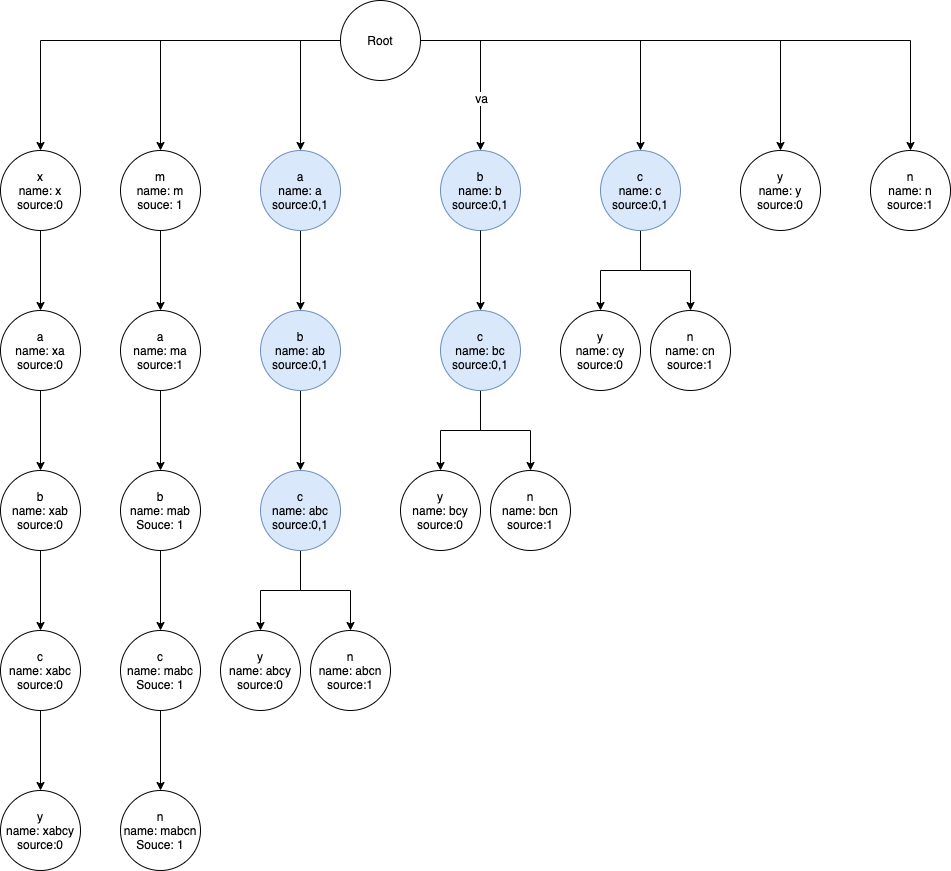
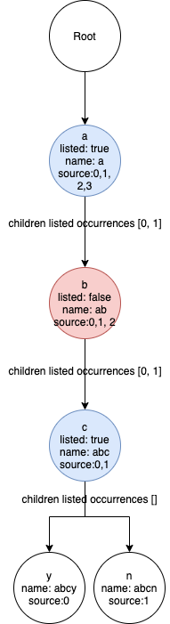
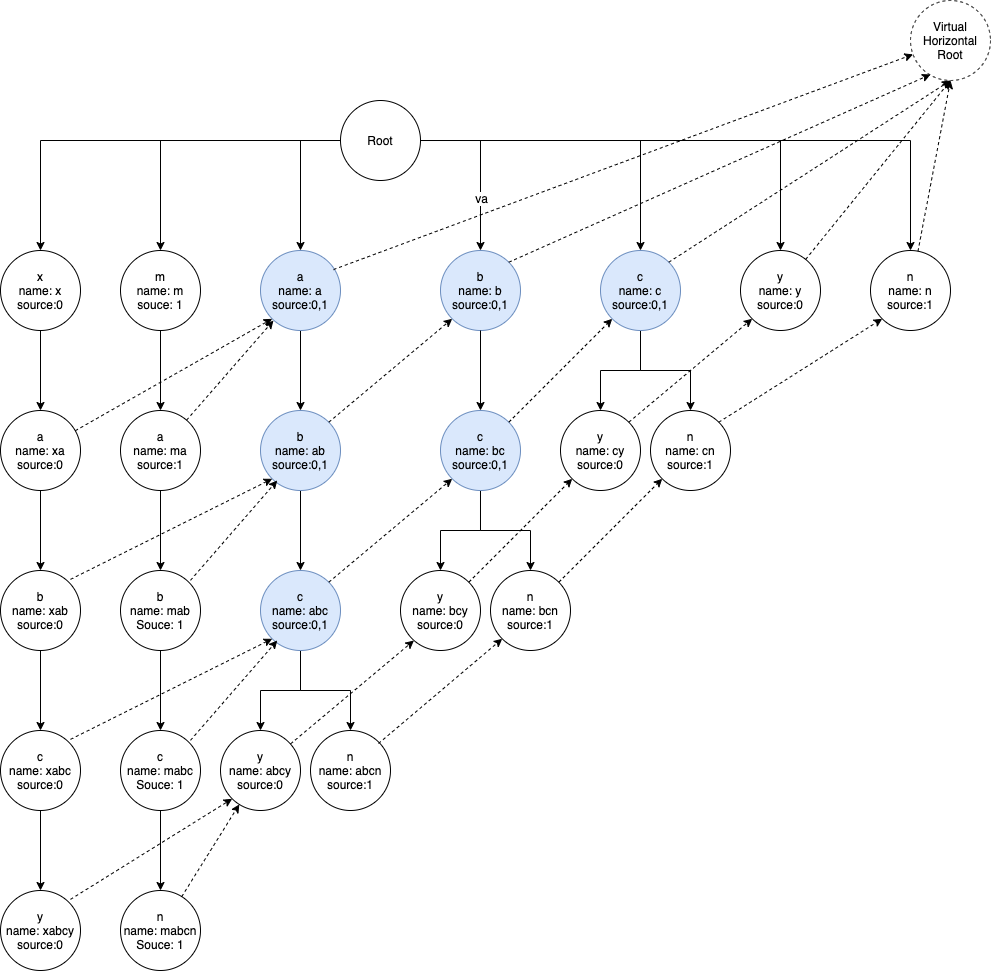

# Find all common substrings

### Problem Description

The way to find all the common parts among strings is as easy as building a [suffix tree](https://en.wikipedia.org/wiki/Suffix_tree).
Then each node would have record their occurrence, but it would be hard to decide how to list them.

Let's take a example to see it in details. Let's say we want to have all the common substring have at least 2 occurrence. Now we have a very small two word sample `[xabcy, mabcn]`, each character here represents a capture substring group, after suffix trie building we would find suffix of duplicated suffix `[abc, bc, ab, a, b, c]` as from suffix trie. 

So the problems comes, how do we list the common substrings without duplication? i.e, only have `abc` listed?

Think of if we have another two word `[bj, bk]`, then we should have result of `[abc, b]`, and the capture group is not overlap with each other, i.e the occurrences of `abc` is `[0,1]` and `b` is from `[2,3]`.

### Solution

#### Abstraction terminology
* `Node`: Each circle in the suffix trie image is a node.
* `Branch`: In the suffix trie, a branch is group of nodes which starts from the root with one direction to the end.

Back to the problem of the duplicated captured groups, they existed in either same branch, or in different branches.

#### Within a branch
 The solution on the same branch is just use Deep First Search to filter listed occurrence in the children.

For example we have input of `[a, ab, abcy, abcn]`, the common substring with at least 2 occurrence is `a` and `abc` as we can see from the following branch image.

#### Across branches

Because by sorting on the same branch we only consider the common substrings extend from trail, e.g. `a, ab, abc`, we also need to consider the substrings extend from head, e.g, `xa, ma, a`.

So we add reference links between the suffix branches with these substrings, and thus construct a virtual trie with the existed node and a new virtual root.

It shows in the following image with node linked by dashed arrow.

So that we adopt the same sorting method on this virtual trie again, use the Deep First Search to filter listed occurrences from the end of the branch. Then we remove the overlapped nodes. Use the origin input `xabcy, mabcn` as example, by first sorting on the same branch, and then sorting on the virtual trie, we get the result that only substring `abc` should be listed.

So overall the algorithms include following steps:
1. Building suffix trie and construct virtual trie with input strings.
2. Filter overlapped common substrings in the suffix trie.
3. Filter overlapped common substrings in the virtual trie.
4. listing the nodes which has attribute `listed: true`

#### Implementation

* [Rust](https://github.com/hanwencheng/common_substrings_rust)
* [Javascript](https://github.com/hanwencheng/CommonSubstrings)

