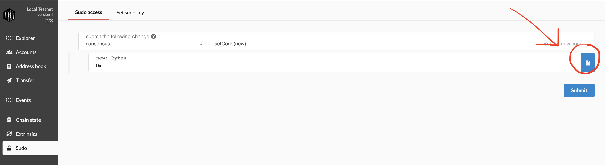

# Parity China Workshop

## Exercise 1: Deploying a Substrate blockchain to a private network

## Run a substrate tempalte node

#### 1. Install substrate, Build the node binary

```shell
# Install Rust toolchains
$ curl https://sh.rustup.rs -sSf | sh -s -- -y && \
	export PATH="$PATH:$HOME/.cargo/bin"
# Build the node binrary
$ git clone -b v1.0 https://github.com/paritytech/substrate
$ cargo install --force --path subkey subkey
$ cd node-template && ./scripts/init.sh && ./scripts/build.sh
$ cargo build --release
```

#### 2. Start as a boot node as Alice 


```shell
$ cd ..
$ ./target/release/node-template \
  --base-path /tmp/alice \
  --chain=local \
  --key //Alice \
  --port 30333 \
  --telemetry-url ws://telemetry.polkadot.io:1024 \
  --validator \
  --name AlicesNode
```

#### 3. Joins in as Bob

```shell
$ ./target/release/node-template \
  --base-path /tmp/bob \
  --chain=local \
  --key //Bob \
  --port 30334 \
  --telemetry-url ws://telemetry.polkadot.io:1024 \
  --validator \
  --name BobsNode \
  --bootnodes /ip4/<Alices IP Address>/tcp/<Alices Port>/p2p/<Alices Node ID>
```

#### 4. Check the State of your blockchai

1. open `https://polkadot.js.org/apps/#/settings`
2. use custom endpoint and input `ws://localhost:9944/`
3. Choose `Explorer` in the left panel, and see the new blocks are generated almost every 10 seconds.

#### Troubleshooting
When consensus is rejected, try clear the data of the chain
1. purge chain data with `./target/release/node-template purge-chain`.
2. delete the temp data in base path. 

## Exercise 2: Build a simple proof of existence blockchain

Create new file called `poe.rs` under `./node-template/runtime/src`, now let's add some stuff in it.

#### 1. Import necessary dependencies
```rust
use support::{decl_module, decl_storage, decl_event, ensure, StorageMap};
use rstd::vec::Vec;
use system::ensure_signed;
```

#### 2. Configure your module to emit events

```rust
pub trait Trait: system::Trait {
    /// The overarching event type.
    type Event: From<Event<Self>> + Into<<Self as system::Trait>::Event>;
}
```

#### 3. Define your module’s event

```rust
decl_event!(
    pub enum Event<T> where AccountId = <T as system::Trait>::AccountId {
        // Event emitted when a proof has been stored into chain storage
        ProofStored(AccountId, Vec<u8>),
        // Event emitted when a proof has been erased from chain storage
        ProofErased(AccountId, Vec<u8>),
    }
);
```

#### 4. Add the storage/state items
```rust
decl_storage! {
	trait Store for Module<T: Trait> as PoeStorage {
        // Define a 'Proofs' storage item for a map with
        // the proof digest as the key, and associated AccountId as value.
        // The 'get(proofs)' is the default getter.
		Proofs get(proofs): map Vec<u8> => T::AccountId;
	}
}
```

#### 5. Add your callable "public" module functions
```rust
decl_module! {
    /// The module declaration.
    pub struct Module<T: Trait> for enum Call where origin: T::Origin {
        // A default function for depositing events
        fn deposit_event() = default;

        // Allow a user to store an unclaimed proof
        fn store_proof(origin, digest: Vec<u8>) {
            // Verify that the incoming transaction is signed
            let sender = ensure_signed(origin)?;

            // Verify that the specified proof has not been claimed yet
            ensure!(!<Proofs::<T>>::exists(&digest), "This proof has already been claimed");

            // Store the proof and the claim owner
            <Proofs::<T>>::insert(&digest, sender.clone());

            // Emit an event that the claim was stored
            Self::deposit_event(RawEvent::ProofStored(sender, digest));
        }

        // Allow the owner of a proof to erase their claim
        fn erase_proof(origin, digest: Vec<u8>) {
            // Determine who is calling the function
            let sender = ensure_signed(origin)?;

            // Verify that the specified proof has been claimed
            ensure!(<Proofs::<T>>::exists(&digest), "This proof has not been stored yet");

            // Get owner of the claim
            let owner = Self::proofs(&digest);

            // Verify that sender of the current call is the claim owner
            ensure!(sender == owner, "You must own this proof to erase it");

            // Remove claim from storage
            <Proofs::<T>>::remove(&digest);

            // Emit an event that the claim was erased
            Self::deposit_event(RawEvent::ProofErased(sender, digest));
        }
    }
}
```

#### 6. Add module into runtime

Edit the `lib.rs` file in the same folder.

```rust
# Step 1: Add module into runtime
mod poe;
```

```rust
# Step 2: Add the trait implementation
impl poe::Trait for Runtime {
	type Event = Event;
}
```

```rust
# Step 3: Update `construct_runtime`
construct_runtime!(
  pub enum Runtime where
  Block = Block,
  NodeBlock = opaque::Block,
  UncheckedExtrinsic = UncheckedExtrinsic
  {
    ...
    POEModule: poe::{Module, Call, Storage, Event<T>},
  }
);
```

#### 7. Compile! 
And be sure you are under `/node-template` folder
```shell
$ cargo build --release
```
See complete [lib.rs](./workshop-china-september/lib.rs) and [poe.rs](./workshop-china-september/poe.rs)

For detail, check Shawn's [Create your first Substrate blockchan tutorial](https://hackmd.io/B-jWKzRCQmq1gPtFFkXjFA#Proof-Of-Existence-Chain), which maybe slightly difference from the tutorial here.

## Exercise 3: Perform a forkless upgrade to our blockchain!

#### 
1. open the blockechain explorer here `https://polkadot.js.org/apps/#/sudo`
2. copy the wasm file into clipboard 
```shell
$ xxd -p ./node-template/runtime/wasm/target/wasm32-unknown-unknown/release/node_template_runtime_wasm.compact.wasm | pbcopy
```
3. Update it under `Sudo` and paste the code to `setCode`



## Further reading

[Substrate Tutorials](https://substrate.dev/en/tutorials)
[Substrate Collectables Workshop](https://substrate.dev/substrate-collectables-workshop/#/)
[A brief summary of everything Substrate and Polkadot](https://medium.com/polkadot-network/a-brief-summary-of-everything-substrate-and-polkadot-f1f21071499d)
[Clone and follow instruction from the Substrate Package](https://github.com/shawntabrizi/substrate-package)
[Join and ask questions in the Substrate Technical channel on Riot](https://riot.im/app/#/room/!HzySYSaIhtyWrwiwEV:matrix.org)
[Explore and read the Substrate Runtime Module Library](https://github.com/paritytech/substrate/tree/master/srml)


